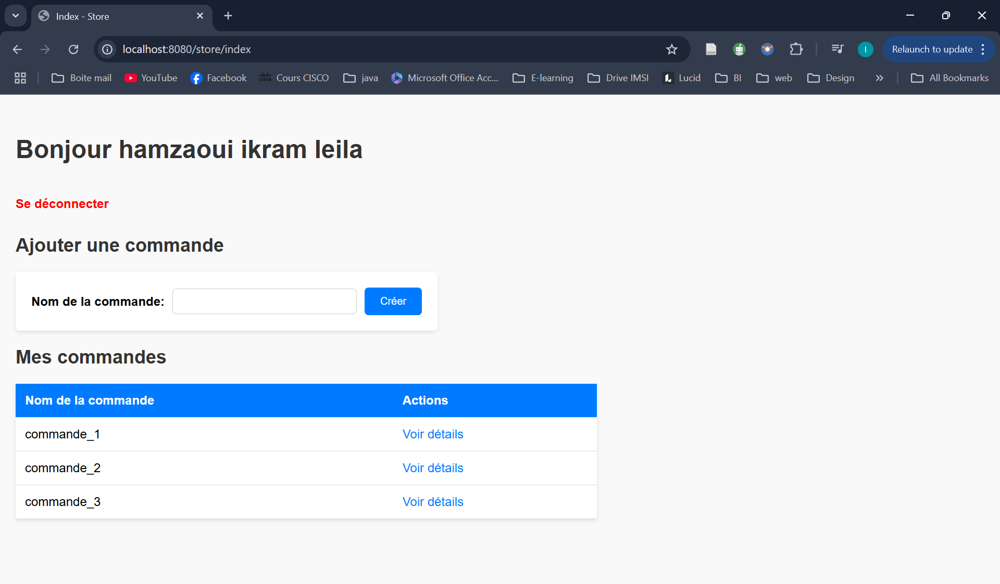

# Application de Gestion des Commandes - Spring

## Description

Le but de cette application est de gérer les commandes d'un magasin. Les utilisateurs peuvent s'inscrire, se connecter, gérer leurs commandes et articles associés à chaque commande. Chaque client peut créer des commandes, ajouter ou supprimer des articles, et afficher la liste des articles d'une commande. Les fonctionnalités sont sécurisées et protégées afin que chaque client puisse accéder uniquement à ses propres commandes.

L'application utilise le framework Spring Boot pour le développement backend, avec une gestion des sessions pour l'authentification des utilisateurs.

## Fonctionnalités

### Itération 1 : Gestion des clients
- **Création de compte** : L'utilisateur peut créer un compte en fournissant un email, un mot de passe, un nom et un prénom.
- **Connexion** : L'utilisateur peut se connecter à l'application en utilisant son email et son mot de passe.
- **Déconnexion** : L'utilisateur peut se déconnecter de l'application à tout moment.
  

### Itération 2 : Gestion des commandes
- **Création de commande** : L'utilisateur peut créer une nouvelle commande et l'associer à son compte.
- **Affichage des commandes** : L'utilisateur peut voir la liste de ses commandes.

### Itération 3 : Gestion des articles
- **Ajout d'articles** : L'utilisateur peut ajouter des articles à une commande existante.
- **Suppression d'articles** : L'utilisateur peut supprimer des articles d'une commande.

### Itération 4 : Impression des commandes
- **Affichage de la commande** : L'utilisateur peut afficher les articles d'une commande en vue de l'impression.

### Itération 5 : Protection des routes de l’application
- **Sécurisation des commandes** : Les routes des commandes sont protégées de manière à ce que chaque client ne puisse accéder qu'à ses propres commandes.

## URL de l'application

L'application est accessible à l'adresse suivante : [http://localhost:8080/store/home](http://localhost:8080/store/home).
